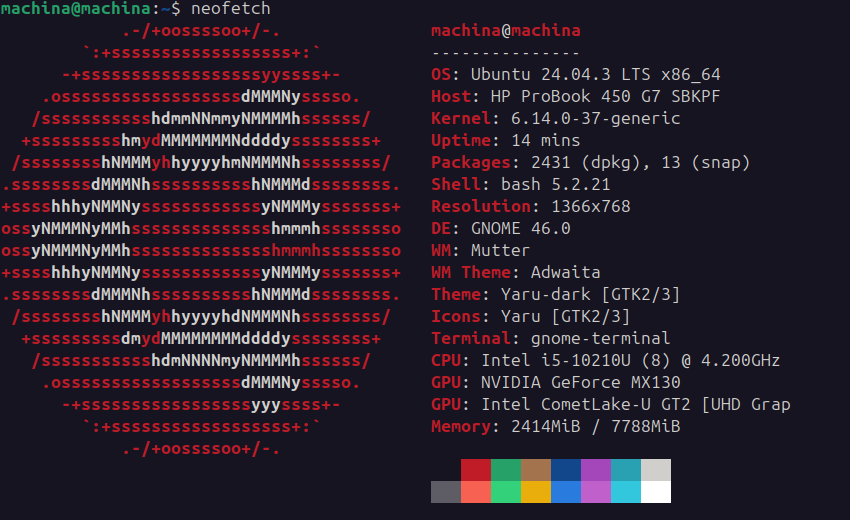

# Device Check — [Your Name]

**Program:** AI.SPIRE Pre-Work
**Date completed:** [YYYY-MM-DD]
**GitHub username:** [your-github-username]

---

## System Specifications

| Specification | Your value |
|---------------|------------|
| Operating System | (e.g., Windows 11 22H2, macOS 14.4, Ubuntu 22.04) |
| OS Build / Version | Ubuntu 24.04 LTS|
| RAM | 64GB |
| CPU Model | Intel Core i9-14900HX |
| CPU Cores | 24 |
| Free Disk Space | 2TB |
| Internet Speed (Download) | (from speedtest.net — Mbps) |

---

## Evidence Checklist

- [ ] Screenshot: OS version
- [ ] Screenshot: RAM and CPU details
- [ ] Screenshot: Free disk space
- [ ] Screenshot: Internet speed test result
- [ ] Screenshot: Admin rights confirmed

**Windows only:**
- [ ] Screenshot: `wsl -l -v` output showing WSL 2
- [ ] Screenshot: `wsl --status` output

---

## Admin Rights Confirmation

**Result:** [Paste command output, or write "Confirmed via System Settings"]

---

## Device Notes

[Any device issues, constraints, or concerns. Write "None" if everything checks out.]

the images are not from my main laptop, they are from my other laptop.
